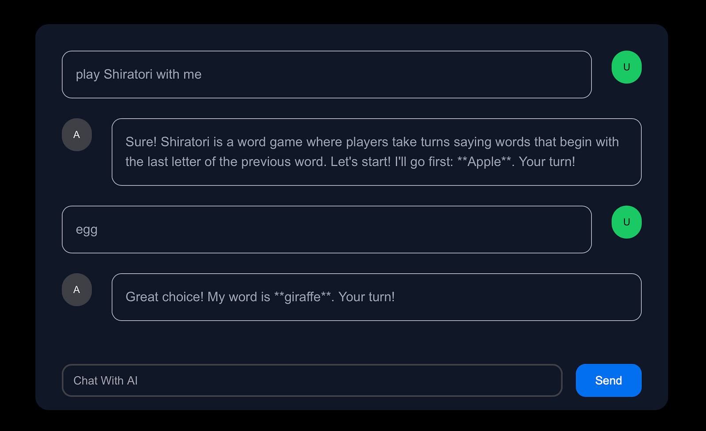

# NextJs + Mastra Demo

A simple chat app demoing integrating Mastra into Next JS app.

For more details in using Mastra as well as a comparision to other agentic frameworks, please check out my blog [NextJs + Mastra: Can We Finally Get Rid of those Agentic Python Backends?](https://medium.com/@itsuki.enjoy/nextjs-mastra-can-we-finally-get-rid-of-those-agentic-python-backends-d1e27503e9b3)

